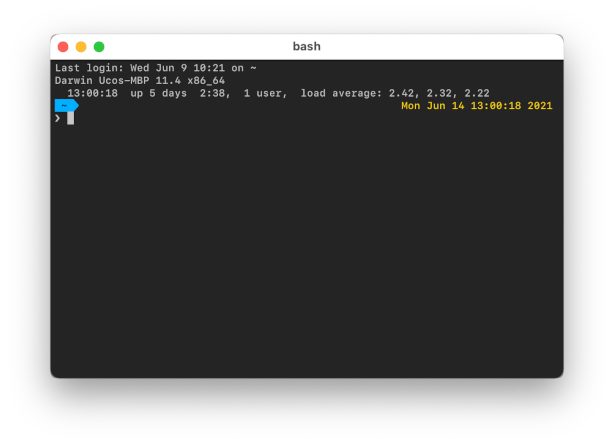

# Uco Theme

A clone of the Powerline Multiline Theme with a few tweaks.

**IMPORTANT:** This theme requires that [a font with the Powerline symbols](https://github.com/powerline/fonts) needs to be used in your terminal emulator, otherwise the prompt won't be displayed correctly, i.e. some of the additional icons and characters will be missing. Please follow your operating system's instructions to install one of the fonts from the above link and select it in your terminal emulator.

This theme is heavily based on the powerline-multiline theme and is dependent on it as it sources code from it.

**Code changes:**

- CWD path is abbreviated
- Date & time on the right without decorations
- Last status on the first-line without history number
- Symbols for scm prompt state

**Theme changes:**

- Prompt symbols and colors that match project logos & colors
- Color changes

**Todo:**

- Optimize the functions instead of copy & paste and add changes
- Merge back to powerline theme when possible

Please see the original Powerline Multiline Theme for more information.
